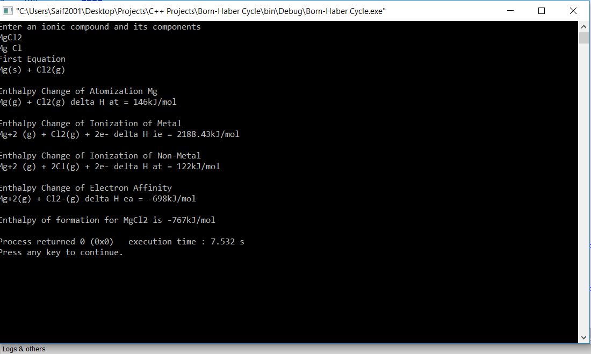

# Born-Haber-Cycle-Calculator
A C++ program that displays the Born-Haber cycle of an ionic compound, complete with all enthalpy and energy values 

To use the program simply type the name of the ionic compound (ie MgCl2 or NaBr) and its constituent components (Mg and Cl or Na and Br) and watch as the program calculates the enthalpy values and creates an energy level diagram of the various enthalpy changes

Example:

